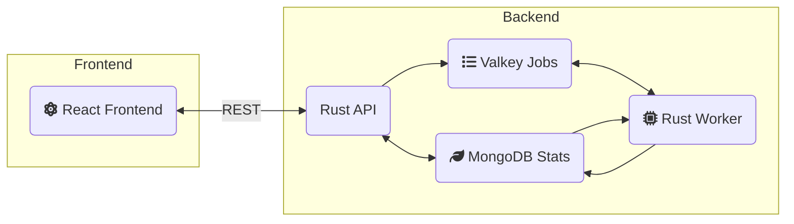

# astats-fast
Service similar to astats.nl, but without timeouts and registration issues

## Architecture

```mermaid
flowchart LR
    subgraph Frontend
    FRONTEND(fa:fa-atom React Frontend)
    end
    subgraph Backend
    BACKEND(Rust API)
    STATS(fa:fa-leaf MongoDB Stats)
    JOBS(fa:fa-list Valkey Jobs)
    WORKER(fa:fa-microchip Rust Worker)
    end
    FRONTEND <-->|REST| BACKEND
    BACKEND <--> STATS
    BACKEND --> JOBS
    JOBS <--> WORKER
    WORKER --> STATS
    STATS --> WORKER
  
```
